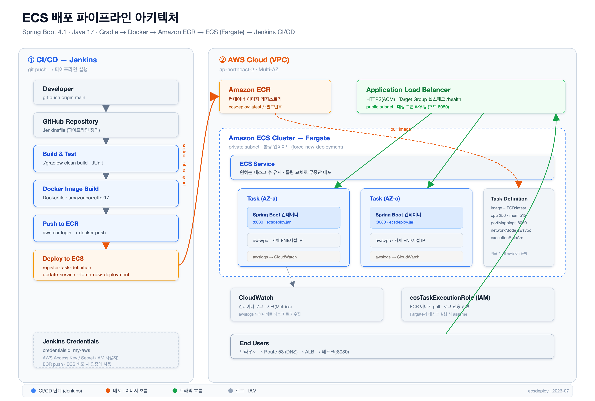
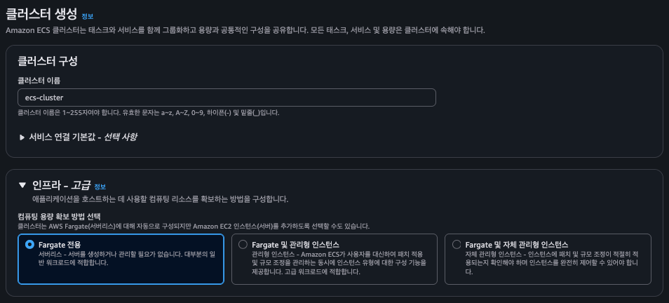
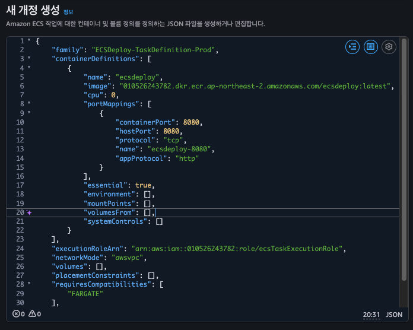
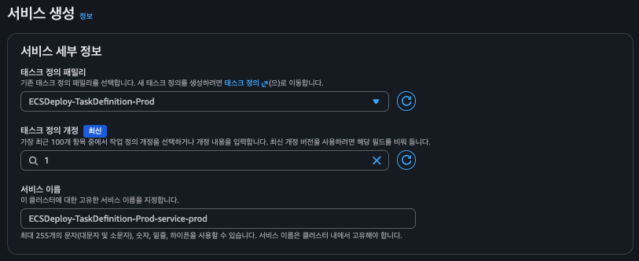
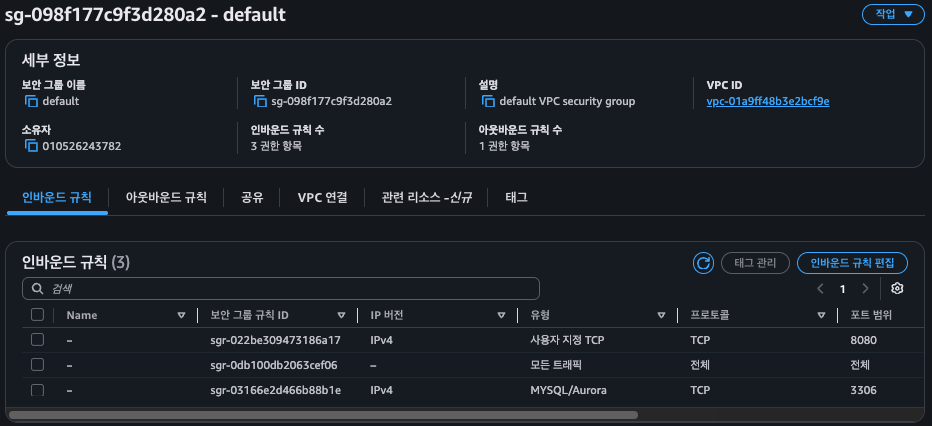

## ECS 배포 파이프라인 아키텍처



## ECS(Elastic Container Service)

* ECS는 Elastic Container Service의 약어다.
* Docker 컨테이너를 쉽고 빠르게 실행, 중단 및 관리할 수 있게 해주는 서비스이다.
* ECS는 다음과 같이 4가지 구성요소가 있다.
    * **Cluster** : 컨테이너가 실행되는 논리적인 그룹.
    * **Task Definition** : 어떤 도커 이미지를 쓸지, CPU/메모리는 얼마나 할당할지 등을 작성한 설게도
    * **Task** : Task Definition을 바탕으로 실제로 실행된 컨테이너 객체
    * **Service** : 클러스터 안에서 일정 개수의 작업을 항상 유지해주는 관리자. 서비스가 감지해 작업을 띄운다.
* ECS는 다음과 같은 3가지 이유로 많이 사용한다.
    * AWS 서비스와 밀접한 통합 : IAM, 로드밸런싱 등 다른 AWS 서비스와 연계가 편리하다.
    * 간편한 확장성 : 트래픽이 몰리면 컨테이너 개수를 자동으로 늘려준다.
    * 운영 오버헤드 감소 : 서버를 직접 구축하고 컨테이너 관리 툴을 설치할 필요가 없이 운영이 단순해진다.
* ECS는 복잡한 서버 관리 없이, 도커 컨테이너를 AWS 환경에서 가장 쉽고 안정적으로 배포하고 싶을 때 쓰면 좋다.

## ECS 클러스터 생성



## Spring ECS 테스크 정의 생성



* 이미지: 직접 빌드한 Spring Boot 앱을 ECR에 push한 이미지를 사용한다. (`Dockerfile` 참고)
* 포트: 스프링 부트 기본 포트인 `8080`을 매핑한다.
* `executionRoleArn`: Fargate가 ECR에서 이미지를 pull하고 CloudWatch에 로그를 쓰려면 실행 역할이 필요하다. (`ecsTaskExecutionRole`)
```json
{
  "requiresCompatibilities": ["FARGATE"],
  "family": "ECSDeploy-TaskDefinition-Prod",
  "containerDefinitions": [
    {
      "name": "ecsdeploy",
      "image": "010526243782.dkr.ecr.ap-northeast-2.amazonaws.com/ecsdeploy:latest",
      "portMappings": [
        {
          "name": "ecsdeploy-8080",
          "containerPort": 8080,
          "hostPort": 8080,
          "protocol": "tcp",
          "appProtocol": "http"
        }
      ],
      "essential": true
    }
  ],
  "volumes": [],
  "networkMode": "awsvpc",
  "memory": "512",
  "cpu": "256",
  "executionRoleArn": "arn:aws:iam::010526243782:role/ecsTaskExecutionRole"
}
```



## ECS 보안 그룹(SG), 인바운드 규칙 설정



## 새로운 버전의 Docker 컨테이너 배포

* [register-task-definition - AWS CLI 2.34.21 Command Reference](https://docs.aws.amazon.com/cli/latest/reference/ecs/register-task-definition.html)

## [JSON 프로세서 jq](https://jqlang.org/manual/)

- jq는 커맨드라인용 JSON 프로세서이다.
- jq는 아주 간단한 문법으로 JSON 구조를 탐색하고 필터링하고 수정할 수 있도록 도와준다.
- 특정값을 추출하거나 데이터를 변환하는 등의 다양한 작업을 수행할 수 있다.

## AWS 대기 명령 services-stable

- Jenkins 파일을 빌드해보면 몇 초 이내에 서비스가 update 되는 것을 확인할 수 있다.
- 하지만 실제로 AWS에서는 서비스를 update 한 이후에 실제 프로젝트가 안정적으로 배포되기 위해서는 일정 시간을 기다려야 한다.
- 만약 우리의 Jenkins 파일에서 테스트와 같은 다음 작업이 있는 경우 바로 그 작업으로 넘어가지 않고 충분히 대기를 시켰다가 AWS 프로젝트가 안정적으로 배포되면 다음 단게로 넘어가는 것이 좋다.
- [services-stable - AWS CLI 2.34.21 Command Reference](https://docs.aws.amazon.com/cli/latest/reference/ecs/wait/services-stable.html#services-stable)